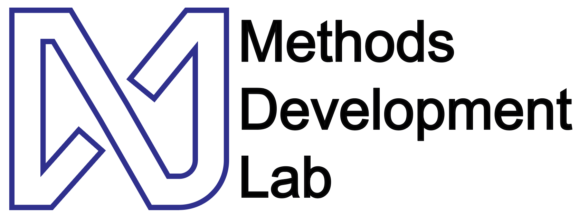

# Home

    
The Methods Development lab (MDL) is a R&D arm of the [Broad Clinical Labs](https://broadclinicallabs.org/) at the [Broad Institute](https://www.broadinstitute.org). The mission of the MDL is to drive expansion of high-value biological frontiers via the concerted development and application of productionizable methods between Broad labs, centers, and platforms.

The MDL addresses current challenges we see at the Broad related to the development of high-performance productionized methods including, but not limited to, RNA isoform sequencing, multiome sequencing, ultra high-throughput perturbation sequencing, and highly efficient WGS. The MDL is specifically designed to function as an integrator of new ideas, align incentives, build teams, and leverage Broad infrastructure to drive flagship efforts.

### We are hiring!

The MDL is looking for molecular and computational scientists at all levels. Contact [Aziz](team.md) if you are interested.
