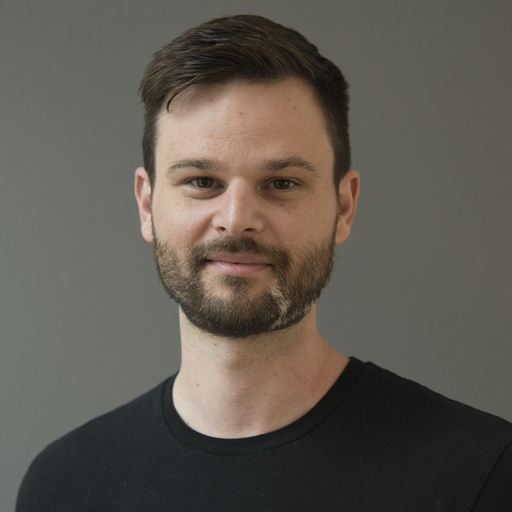
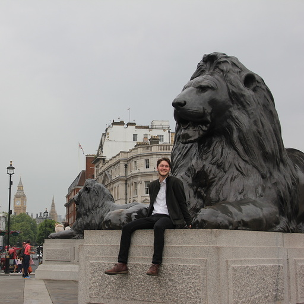
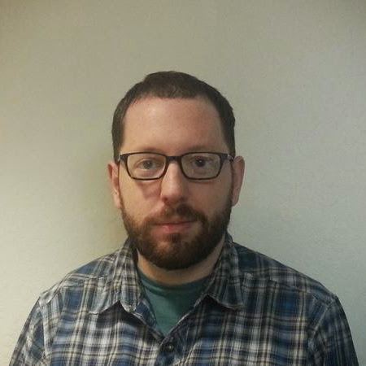
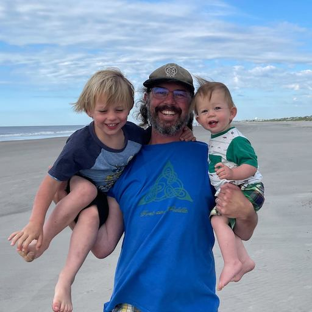
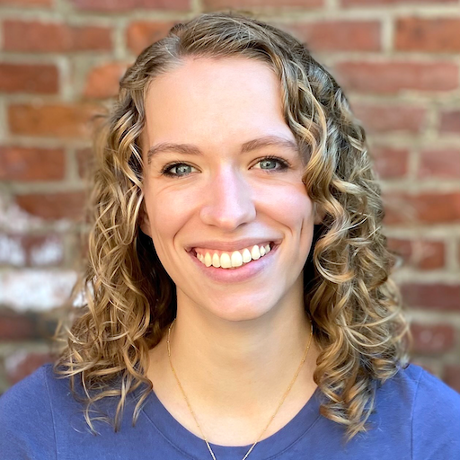
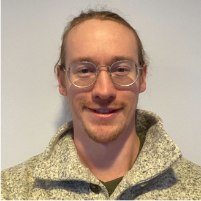

# Lab Members

<!-- 
the empty comments in the header are necessary to convince markdown it is a table.
-->

### We are hiring!

The MDL is looking for molecular and computational scientists at all levels. Contact Aziz if you are interested.

| | <!-- --> | <!-- -->
|-|----------|---------
|  | Aziz Al'Khafaji   aalkhafa \[at\] broadinstitute \[dot\] org | Associate Director, MDL
|  | Asa Shin | Research Associate
|  | James Webber | Senior Computational Scientist
|  | Zachary Zwirko | Senior Research Scientist II
|  | Frances Keer | Graduate Student  NSF Fellow Co-mentored with [Paul Blainey](http://blainey.mit.edu/)
|  | Dan Bartlett | Postdoctoral Associate
|  | Alexandre Melnikov | Senior Research Scientist
|  | Akanksha Khorgade | Senior Computational Associate
