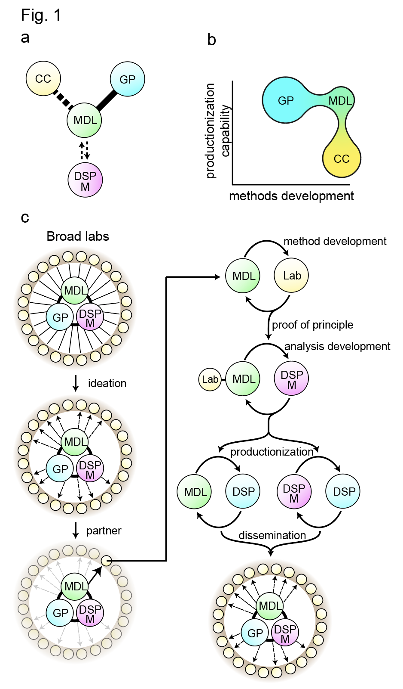
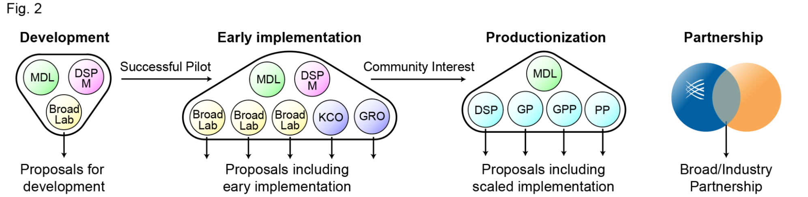

# Vision

The combination of biotechnological and computational advances over the past decade have substantially augmented our ability to create high-performance methods, thereby driving biological discovery and development of transformative medical breakthroughs. During this time of great biotechnological potential there exists an opportunity for the Broad to, in an organized and interdisciplinary fashion, identify high-value scientific frontiers and generate and disseminate high-performance end-to-end productionized approaches. While the current accelerated pace of methods development offers great promise, the rapid expansion of novel techniques gives rise to new challenges regarding adoption and effective implementation. 

Many newly developed methods require technical and analytical capabilities outside of the expertise of interested users/labs, hindering adoption. Furthermore, many published methods are far from mature, often having suboptimal molecular workflows and/or buggy analysis pipelines – greatly limiting their utility. 

This page details the Methods Development Lab, a joint venture between [Cell Circuits](https://www.broadinstitute.org/genomeregulation-cellcircuitry-epigenomics) and the [Genomics Platform](https://www.broadinstitute.org/reading-and-editing-biology/genomics-platform) which will play a central role in coordinating the development, productionization, and dissemination of methods of great interest to the Broad community. While elements of this proposal are not new to the Broad, the proposed structure and relationships of the MDL purposefully seek to generate a collective and sustainable model of methods development and implementation. By coordinating efforts in this way, the Broad will minimize technical and analytical barriers, effectively equipping Broad labs with cutting edge tools to drive scientific impact and discovery. 

## Structure & Function

{: style="width:300px;float:right"}

The MDL serves as a bridge between platforms, centers, and labs - nucleating coordinated efforts via development and scaled implementation of high-impact methods (Figure 1a,b). The MDL pursues development of methods that meet the following criteria:

 1. Expand a high-value biological frontier
 1. Are of broad interest to Broad investigators
 1. Have a reasonable route to productionization at GP or other relevant platform, and
 1. Exist outside the scope of current commercial activity. 

Such pipeline engagement over the course of method ideation and refinement is essential to selecting and maturing opportunities *prior* to investment and development. 

Once an approach is nominated, a partner lab will be selected with which to co-develop – ensuring efforts are geared toward answering existing biological questions. Ideal pilot partners will be a function of personnel dedication, model tractability, and cost sharing during early development. Once data is generated from the pilot experiments, the MDL and partner lab will collaborate with DSP Methods to develop computational methods to analyze the pilot data. 

At this juncture, iterative methods refinement will likely take place between the molecular and computational teams. Once the molecular and computational methods are optimized, they will transition to productionization; subsequently being disseminated to the Broad community (Figure 1c).

## Funding & Sustainability

Sustainability is a central feature of the MDL structure. At key stages of methods development and implementation, these novel approaches/data will be included in grant proposals (Figure 2), as well as proposed to industry as partnership opportunities. 

Once developed, the GP can option to productionize methods which display sufficient interest across the Broad community. The scaled dissemination of cutting-edge tools across Broad labs will result in a broad competitive increase of grant proposals, ultimately creating new opportunities across the Institute. Additionally, certain methods will have the potential to nucleate Broad/Industry partnerships – uniquely enabling collaborative development and resourcing of ambitious flagship projects. Filing of intellectual property will be pursued where appropriate, enabling licensing and commercialization. 

{: style="height:300px"}
